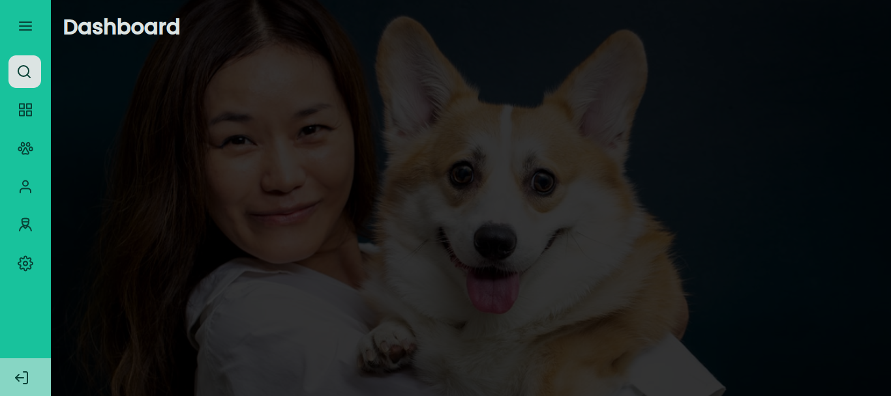
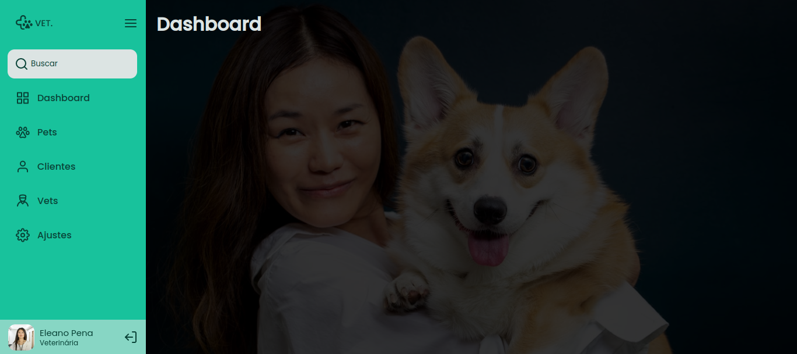

<h1 align="center"> Sidebar </h1>

> Nesse desafio foi proposto criar um menu Sidebar, e todas vez que clicasse no botão do menu, expandisse o Menu, e quando clicasse de novo voltasse ao seu tamanho original.


 

> ## 🧰 **Techs**
* **HTML**
* **CSS**
* **JavaScript**
* **Figma**


<h2 align="center"> Código CSS </h2>

```CSS
/* Estilos que espande o Sidebar */
.expand, .expand-article {
    width: 250px;
    transition: width .7s;
}

.expand-article {
    justify-content: space-between;
}

.expand-a {
    opacity: 1;
    transition: opacity .7s;
}

.expand-buscar {
    width: 222px;
    transition: width .7s;
}

.expand-figure {
    width: 150px;
    opacity: 1;
    transition: width .7s, opacity .7s;
}

.expand-logo {
    width: 185px;
    transition: width .7s;
}

.expand-main {
    padding-left: 250px;
    transition: padding-left .7s;
}

@media screen and (max-width: 600px) {
    .expand-main {
        padding-left: 78px;
    }
}
```

<h2 align="center"> Código JS </h2>

```JS
const buttonMenu = document.querySelector(".btn_menu")

const header = document.querySelector("header")
const logoVet = document.querySelector("header > div figure")
const input = document.querySelector("nav ul li input")
const article = document.querySelector("article")
const figure = document.querySelector("article figure")
const main = document.querySelector("main")
const a = document.querySelectorAll("a")

buttonMenu.onclick = () => {
    header.classList.toggle("expand")
    logoVet.classList.toggle("expand-logo")
    input.classList.toggle("expand-buscar")
    article.classList.toggle("expand-article")
    figure.classList.toggle("expand-figure")
    main.classList.toggle("expand-main")

    for(indice in a) {
        a.item(indice).classList.toggle("expand-a")
    }
}
```